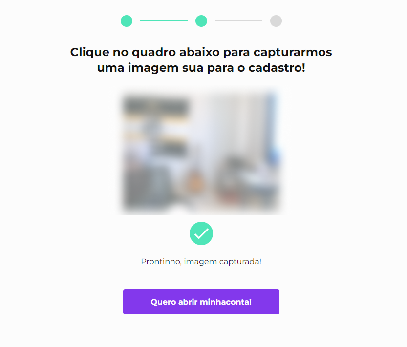

<h1 align="center">Validação de Formulário com JS</h1>

## Sobre o Projeto
Projeto realizado durante o curso de JavaScript: validando formulários 
curso da [Alura](https://cursos.alura.com.br/)

### funcionalidades
- [x] aplicando atributos de validação de formulário com HTML5;
- [x] validação dos digitos verificadores do CPF;
- [x] validações de maioridade a partir da comparação de datas;
- [x] Customização de mensagens de erro para cada tipo de campo do formulário;
- [x] Integrando a webcam do usuário em uma tela do navegador
- [x] Captura de fotos via webcam
- [x] Salve e edite dados salvos no navegador;

### Tecnologias usadas no projeto

- HTML5, CSS
- JavaScript
    - canvas
    - navigation
    - localStorage
    - evento blur
    - evento invalid
    - evento submit

## Lucas Gabriel Moya

- Website - [https://lucasgabrielmoya-nu.vercel.app/](https://lucasgabrielmoya-nu.vercel.app/)
- Linkedin - [Lucas Gabriel Moya](https://www.linkedin.com/in/lucas-gabriel-moya/)

## Layout do Projeto

